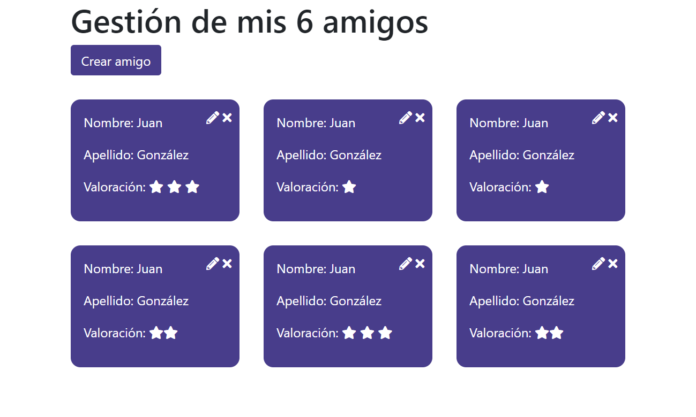
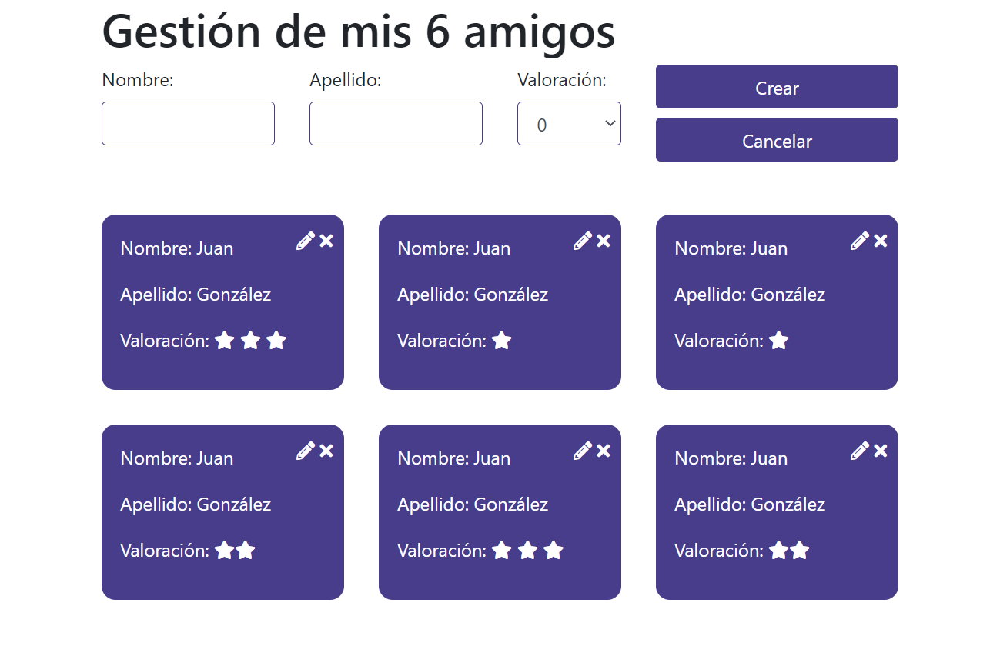

# Examen Frontend

Deberás crear una aplicación React para gestionar un listado de amigos. La maqueta la tienes aquí:

## Maquetación

Maqueta sin formulario

Maqueta con formulario

Utiliza la librería Bootstrap (versión 4) cargada por npm y la librería de iconos react-icons para poder usar estos tres iconos de Font Awesome:
- FaTimes
- FaPencilAlt
- FaStar

La aplicación consistirá en un listado CRUD. El encabezado de la página debe mostrar el número de amigos (lo que ahora ves que es un 6), y se deben poder crear, editar y borrar amigos.

- Para crear, se tiene que pulsar en el botón “Crear amigo” y se abrirá el formulario para crear. Al pulsar en el botón Cancelar, debe desaparecer el formulario.
- Para modificar, se tiene que pulsar en el icono de lápiz de cualquier amigo, y se abrirá el mismo formulario pero cambiando el texto del botón por “Modificar”, y con los campos rellenos.
- Para borrar se tiene que pulsar en el icono de borrar en cada amigo.

La fuente de datos será una API local de amigos, con la que podremos comunicarnos así:

- GET [http://localhost:3001/amigos/ ](http://localhost:3001/amigos/)  <- devuelve el listado de amigos
- DELETE [http://localhost:3001/amigos/3](http://localhost:3001/amigos/3) <- borra el amigo con id 3
- PUT [http://localhost:3001/amigos/3](http://localhost:3001/amigos/3) <- modifica el amigo con id 3 (hay que mandarle el amigo modificado en el body)
- POST [http://localhost:3001/amigos/](http://localhost:3001/amigos/ )-> crea un amigo (hay que mandarle el nuevo amigo en el body)

Crea un repositorio en GitHub y despliega la app en Netlify. No hace falta que hagas commits en este examen, sólo el commit final. Cuando acabes, envía un correo a [mario@mariogl.com] (mario@mariogl.com) con las dos URL, la de GitHub y la de Netlify.
